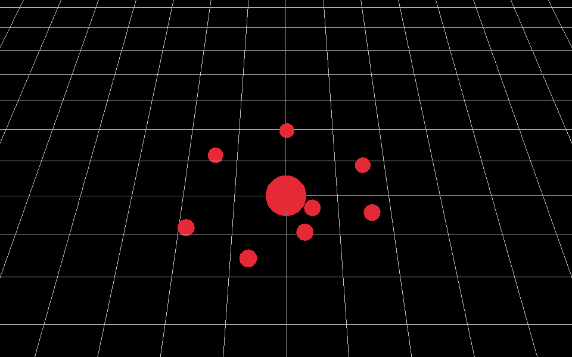

# N-Body Physics Simulator
This is a simple n-body physics simulator. It is currently in very early stages, and the core physics logic is still in progress.

## Images

## Planned Features
- [ ] More advanced camera dynamics such as panning
- [ ] Ability to spawn in bodies and objects during runtime
- [ ] Support more advanced integration methods (Runge-Kutte, Vertlet, etc.)
- [ ] Optimize with Barnes-Hutte Algorithm
- [ ] Preload Simulations (galactic collisions, fluid dynamics, etc.)
